# Tablas


 

# CREATE TABLE 


 
``` sql

CREATE TABLE [tblcliente](
    [Patient_ID] [bigint] IDENTITY(1,1),
    [cliente_code] [varchar](50) NOT NULL,
    [cliente_name] [varchar](50),
    [direcion] [varchar](25),
    [ciudad] [varchar](50),
    [fecha] [datetime],
  ) ON [PRIMARY]

```


| Comando SQL   | ¿Para qué sirve?   |   	¿Qué es?      |
|:-------------:|:------------------:|:------------------:|
| CREATE TABLE   | Sirve para crear una nueva tabla definición de datos  dentro de una base (DDL). de datos,definiendo sus columnas y tipos de datos | Comando de definición de datos (DDL). |          

# pasos

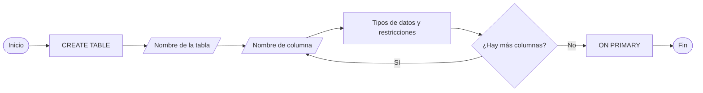
      


# CREATE TABLE con llave fk (FOREIGN)

``` sql sws

CREATE TABLE controles(
    [cliente_ID] [bigint] IDENTITY(1,1),
    [controles] [varchar](50) NOT NULL,
    [consola] [varchar](50),
    [pc] [varchar](25),
    [sistema_operativo] [varchar]
    CONSTRAINT FK_controles_cliente_ID 
    FOREIGN KEY (cliente_ID) 
       REFERENCES tbljuego2(cliente_ID));

```

| Comando SQL  | ¿Para qué sirve?   |   	¿Qué es?     |
|:------------:|:------------------:|:------------------:|
| CREATE TABLE | Sirve para crear una nueva tabla básica dentro de una base | Comando de definición de datos (DDL) |   

# pasos

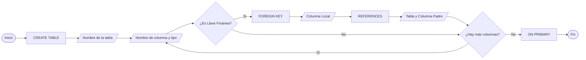

# SELECT

``` sql

SELECT
	cs.CustomerID
	,cs.Name
	,cs.CountryID
	,cn.CountryName
FROM Customers cs
INNER JOIN Countries cn
	ON cs.CountryID = cn.CountryID;

```

| Comando SQL  | ¿Para qué sirve?   |   	¿Qué es?     |
|:------------:|:------------------:|:------------------:|
| SELECT | Sirve para consultar, buscar y mostrar los datos almacenados en una o más tablas.| Comando de manipulación de datos (DML).| 


# pasos

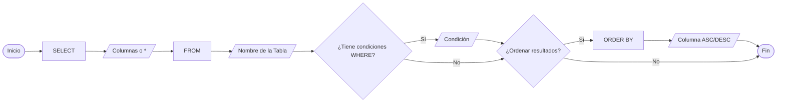

# insert

``` sql

insert into [tbljuego2] ([nombre_del_cliente],[rol_de_juego],[juego],[precio],[fecha_de_compra])
values ('PAULO','AAVENTURA','MINECRFT','24','2026-10-25'),
       ('ROCKY','SHOTER','VALORANT','60','2026-10-25'),
       ('ENYER','ACCION','BATLEFIELD','60','2026-10-25')

```

| Comando SQL  | ¿Para qué sirve?   |   	¿Qué es?     |
|:------------:|:------------------:|:------------------:|
| SELECT       |Sirve para agregar nuevas filas con datos reales dentro de una tabla que ya creada Comando de manipulación de datos | Comando de manipulación de datos |


# pasos

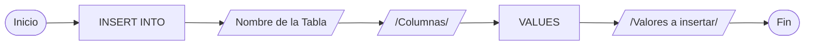

# update

``` sql

update [dbo].[tblCliente] 
set [Fecha de la cita] = 2026-10-26
where cliente_ID IN (20,21,22)

```

| Comando SQL  | ¿Para qué sirve?   |   	¿Qué es?     |
|:------------:|:------------------:|:------------------:|
| UPDATE       | Sirve para actualizar los valores de las columnas en un egistro. | Comando de manipulación de datos|


# pasos

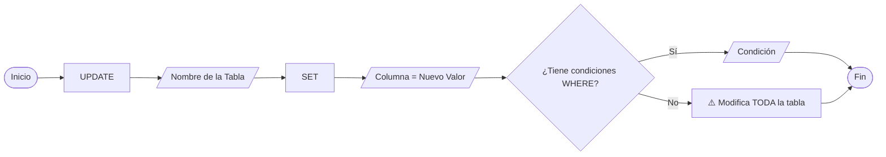

# delete

``` sql

delete from [dbo].[tblCliente]
where cliente_ID = 1

```

| Comando SQL  | ¿Para qué sirve?   |   	¿Qué es?     |
|:------------:|:------------------:|:------------------:|
| DELETE       | Sirve para actualizar los valores de las columnas en un egistro. | Comando DML para eliminar registros de de las tablas |   


# pasos

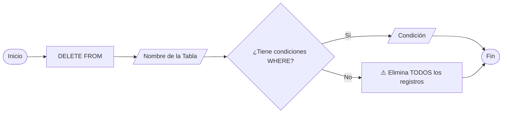

``` sql

  (\(\
  (-.-)
  °_(")(")

```
# join inner

``` sql

SELECT 
    c.[cliente_ID],
    c.[cliente_code],
    c.[cliente_name],
    c.[direcin],
    c.[ciudad],
    c.[Fecha de la cita],
    j.[nombre_del_cliente] AS juego_cliente,
    j.[rol_de_juego] AS rol,
    j.[juego],
    j.[precio],
    j.[fecha_de_compra]
FROM [master].[dbo].[tblCliente] AS c
INNER JOIN [master].[dbo].[tbljuego2] AS j 
    ON c.[cliente_ID] = j.[cliente_ID];

```

| Comando SQL  | ¿Para qué sirve?   |   	¿Qué es?     |
|------------- |:------------------:|:------------------:|
| INNER JOIN   | Sirve para combinar filas cuando hay una coincidencia de datos en ambas tablas. | Cláusula de selección para vincular dos o de las tablas más tablas en SQL. |   


# pasos

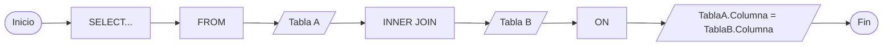


# join left

``` sql

SELECT 
    c.[cliente_ID],
    c.[cliente_code],
    c.[cliente_name],
    c.[direcin],
    c.[ciudad],
    c.[Fecha de la cita],
    j.[nombre_del_cliente] AS juego_cliente,
    j.[rol_de_juego] AS rol,
    j.[juego],
    j.[precio],
    j.[fecha_de_compra]
FROM [master].[dbo].[tblCliente] AS c
left JOIN [master].[dbo].[tbljuego2] AS j 
    ON c.[cliente_ID] = j.[cliente_ID];

``` 

| Comando SQL  | ¿Para qué sirve?   |   	¿Qué es?     |
|------------- |:------------------:|:------------------:|
| left JOIN    | Sirve para traer todos los datos de la tabla izquierda y solo coincidencias de la derecha. | Cláusula de selección para vincular dos o más tablas en SQL. |   


# pasos

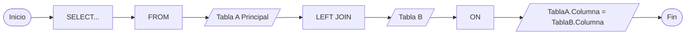


# top


``` sql

    SELECT TOP (3) cliente_ID 
FROM tblCliente 
WHERE cliente_ID < 18
ORDER BY cliente_ID;

```

| Comando SQL  | ¿Para qué sirve?   |   	¿Qué es?     |
|------------- |:------------------:|:------------------:|
| TOP          | Sirve para Sirve para especificar el número máximo de filas que deseas que se muestren. | que deseas que se muestren. |   


# pasos

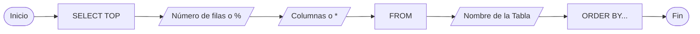


# like y tipos


``` sql

select * from tblCliente
where cliente_name like 'A%'

``` 

| Comando SQL  | ¿Para qué sirve?   |   	¿Qué es?     |
|------------- |:------------------:|:------------------:|
| LIKE         | Sirve para Sirve para buscar un patrón de texto en una columna. | Operador de comparación usado en la cláusula WHERE. |   


# pasos

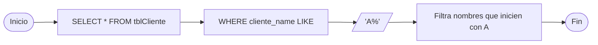

``` sql 

select * from tblCliente
where cliente_name LIKE 'p_d_o'

```

| Comando SQL  | ¿Para qué sirve?   |   	¿Qué es?     |
|------------- |:------------------:|:------------------:|
| % (Tipo 1)   | Sirve para representar cero, uno o más caracteres cualquiera.| Comodín de búsqueda para múltiples caracteres. |   


# pasos

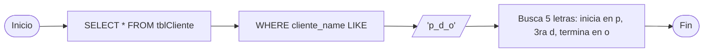

``` sql


select * from tblCliente
where cliente_name  LIKE '[^A-M]%'

``` 

| Comando SQL  | ¿Para qué sirve?   |   	¿Qué es?     |
|------------- |:------------------:|:------------------:|
| _ (Tipo 2)   | Sirve para representar exactamente un único carácter en esa posición. | Comodín de búsqueda para un solo carácter |


# pasos

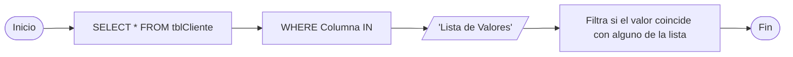

``` sql

select * from tblCliente
where cliente_name  LIKE '[JM]an'

``` 

| Comando SQL  | ¿Para qué sirve?   |   	¿Qué es?     |
|------------- |:------------------:|:------------------:|
| [] (Tipo 3)  | Sirve para coincidir con cualquier letra o número que esté dentro. | Comodín de búsqueda para conjuntos o rangos | 


# pasos


# in


``` sql

 select * from tblCliente
  where cliente_name in  ('L','kira')

```

| Comando SQL  | ¿Para qué sirve?   |   	¿Qué es?     |
|------------- |:------------------:|:------------------:|      
| in           | Sirve para comprobar si un valor coincide con algún elemento de una lista. | Operador de reducción lógica usado en la cláusula WHERE. |


# pasos


# between


``` sql

  select * from tblcarro2
  where cliente_ID  between 1 and 4

```

| Comando SQL  | ¿Para qué sirve?   |   	¿Qué es?     |
|------------- |:------------------:|:------------------:|
| BETWEEN      | Sirve para buscar valores dentro de un rango mínimo y máximo inclusive. | Operador de filtrado lógico usado en la cláusula WHERE. |   


# pasos

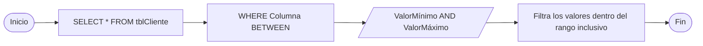


# IS NULL


``` sql

SELECT precio_del_viaje 
FROM tblchofer2 
WHERE precio_del_viaje IS NULL;


```


| Comando SQL  | ¿Para qué sirve?   |   	¿Qué es?     |
|------------- |:------------------:|:------------------:|
| is null     | 	• Evalúa si un campo no tiene datos. la columna no tiene ningún dato asignado. | Un operador de comparación lógico. |   


# pasos

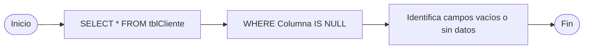


# SUM


``` sql

SELECT SUM (Precio * stock) 
FROM tblalmacen2; 

```


| Comando SQL  | ¿Para qué sirve?   |   	¿Qué es?     |
|------------- |:------------------:|:------------------:|
| sum      | Suma todos los valores de una columna. Ignora los valores NULL. | 	Una función de agregación para valores numéricos. |   


# pasos

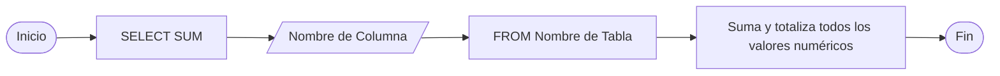


# AVG

``` sql

SELECT AVG(stock) 
FROM tblalmacen2;

```


| Comando SQL  | ¿Para qué sirve?   |   	¿Qué es?     |
|------------- |:------------------:|:------------------:|
| avg      | Calcula el promedio matemático de los valores numéricos de una columna. | 	Una función de agregación. | 


# pasos

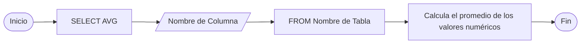

# MIN

``` sql

SELECT MIN(stock) 
FROM tblalmacen2;

```


| Comando SQL  | ¿Para qué sirve?   |   	¿Qué es?     |
|------------- |:------------------:|:------------------:|
| min      | • Encuentra el valor más bajo o mínimo en una columna específica. | Una función de agregación. Es una herramienta de análisis en SQL que examina un conjunto de filas para extraer el límite inferior o valor mínimo de los datos. | 


# pasos

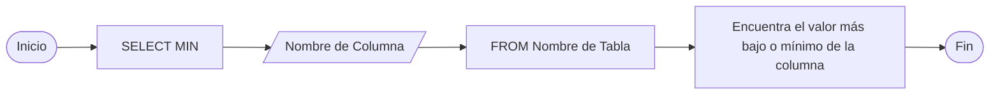

# max

``` sql

SELECT max(stock) 
FROM tblalmacen2;

```


| Comando SQL  | ¿Para qué sirve?   |   	¿Qué es?     |
|------------- |:------------------:|:------------------:|
| max     | Encuentra el valor más alto o máximo en una columna específica. | Una función de agregación. Es una herramienta de análisis en SQL que examina un conjunto de filas para extraer el límite superior o valor máximo de los datos. | 


# pasos

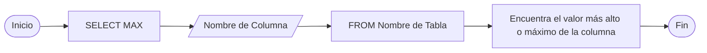


# count

``` sql

SELECT COUNT(ciudad)  
from tblCliente;

```


| Comando SQL  | ¿Para qué sirve?   |   	¿Qué es?     |
|------------- |:------------------:|:------------------:|
| count      | Cuenta el número total de filas o registros que cumplen con una condición. | Una función de agregación. Es una herramienta de conteo cuantitativo en SQL que devuelve un único número entero correspondiente a la cantidad de registros evaluados.| 


# pasos

``` mermaid
graph LR
    Inicio([Inicio]) --> A[SELECT COUNT] --> B[/Nombre de Columna o */] --> C[FROM Nombre de Tabla] --> D[Cuenta el número total de filas o registros] --> Fin([Fin])

```


# distinct

``` sql

select distinct juego
from tbljuego2


```

| Comando SQL  | ¿Para qué sirve?   |   	¿Qué es?     |
|------------- |:------------------:|:------------------:|
| distinct     | Elimina las filas duplicadas del resultado de una consulta.Asegura que cada fila devuelta sea única y no se repita la misma información. | es Una cláusula de filtrado de resultados.  |


# pasos

``` mermaid
graph LR
    Inicio([Inicio]) --> A[SELECT DISTINCT] --> B[/Nombre de Columnas o */] --> C[FROM] --> D[/Nombre de la Tabla/] --> Fin([Fin])

```
  


# GROUP BY 
``` sql

SELECT precio, AVG(Precio) AS PrecioPromedio
FROM tblalmacen2
GROUP BY Precio;
```


| Comando SQL  | ¿Para qué sirve?   |   	¿Qué es?     |
|------------- |:------------------:|:------------------:|
| GROUP BY      | Agrupa filas que tienen los mismos valores en columnas específicas. | Una cláusula de agrupación | 


# pasos

``` mermaid
graph LR
    Inicio([Inicio]) --> A[SELECT Columnas, FuncionAgregacion] --> B[FROM Tabla] --> C[GROUP BY] --> D[/Columnas a agrupar/] --> Fin([Fin])

```


# HAVING

``` sql

SELECT precio, COUNT(*) AS TotalProductos
FROM tblalmacen2
GROUP BY Precio
HAVING COUNT(*) > 1;


```

 

| Comando SQL  | ¿Para qué sirve?   |   	¿Qué es?     |
|------------- |:------------------:|:------------------:|
| HAVING      | Filtra los resultados de una agrupación creada previamente con GROUP BY. | Una cláusula de filtrado condicional para grupos | 


# pasos

``` mermaid
graph LR
    Inicio([Inicio]) --> A[SELECT... GROUP BY] --> B[HAVING] --> C[/Condición sobre la función de agregación/] --> D[Filtra los grupos que cumplen la condición] --> Fin([Fin])

```


# VIEW

``` sql

CREATE VIEW vcliente AS
SELECT cliente_ID, cliente_code,ciudad
FROM [dbo].[tblCliente]
WHERE cliente_ID  > 1;

```


| Comando SQL  | ¿Para qué sirve?   |   	¿Qué es?     |
|------------- |:------------------:|:------------------:|
| VIEW  | 	Sirve para simplificar consultas complejas, ocultar la estructura real de la base de datos por seguridad y reutilizar filtros de datos guardados sin duplicar la información física. | Una tabla virtual basada en el conjunto de resultados de una consulta SQL predefinida que no almacena datos físicamente. | 


# pasos

``` mermaid
graph LR
    Inicio([Inicio]) --> A[CREATE VIEW] --> B[/Nombre de la Vista/] --> C[AS] --> D[SELECT... Consulta Base] --> Fin([Fin])

```

# index

``` sql

  CREATE INDEX cliente_ID
ON [dbo].[tblchofer2] (cliente_ID);

```

(estructura de datos auxiliar que acelera la velocidad de las consultas de búsqueda y recuperación de información en una tabla)

| Comando SQL  | ¿Para qué sirve?   |   	¿Qué es?     |
|------------- |:------------------:|:------------------:|
| indes | Sirve para acelerar drásticamente la velocidad de búsqueda y recuperación de datos en una tabla, reduciendo el tiempo que le toma al motor de la base de datos encontrar registros específicos. | Es una estructura de datos física (generalmente un árbol B o B-Tree) que se crea en una o más columnas de una tabla | 


# pasos

``` mermaid
graph LR
    Inicio([Inicio]) --> A[CREATE INDEX] --> B[/Nombre del Índice/] --> C[ON] --> D[/Nombre de la Tabla/] --> E[/Columnas a indexar/] --> Fin([Fin])

```

# CREATE PROCEDURE

``` sql

  CREATE PROCEDURE ObtenerLosProductos
AS
BEGIN
    SELECT objeto,precio,stock 
    FROM [dbo].[tblalmacen2];
END;
GO

```


| Comando SQL  | ¿Para qué sirve?   |   	¿Qué es?     |
|------------- |:------------------:|:------------------:|
|CREATE PROCEDURE| |CREATE PROCEDURE| Filtra los resultados de una agrupación creada previamente con GROUP BY. | Una cláusula de filtrado condicional para grupos || Es un bloque de código SQL reutilizable que se almacena directamente en la base de datos para ser ejecutado cuando se le llame. | 


# pasos

``` mermaid
graph LR
    Inicio([Inicio]) --> A[CREATE PROCEDURE] --> B[/Nombre del Procedimiento/] --> C[//Parámetros de Entrada/Salida Opcionales//] --> D[AS BEGIN] --> E[Consultas SQL / Lógica interna] --> F[END] --> Fin([Fin])


```


  


``` sql
conejo se separador de tiquets
  (\(\
  (-.-)
  °_(")(")

```

# uniom

``` sql 
SELECT objeto FROM [dbo].[tblalmacen2]
UNION 
SELECT objeto FROM [dbo].[tblalmacen3];
```

()

| Comando SQL  | ¿Para qué sirve?   |   	¿Qué es?     |
|------------- |:------------------:|:------------------:|
| UNION | 	Sirve para combinar el resultado de dos o más consultas SELECT en un único conjunto de datos, eliminando automáticamente los registros duplicados. | Es un operador de conjunto que une filas de múltiples tablas o consultas que tienen la misma estructura. | 


# pasos

``` mermaid
graph LR
    Inicio([Inicio]) --> A[SELECT Consulta 1] --> B[UNION] --> C[SELECT Consulta 2] --> D[Combina resultados y elimina duplicados] --> Fin([Fin])


```


# union all

``` sql

SELECT objeto FROM [dbo].[tblalmacen2]
UNION all
SELECT objeto FROM [dbo].[tblalmacen3];

```

()

| Comando SQL  | ¿Para qué sirve?   |   	¿Qué es?     |
|------------- |:------------------:|:------------------:|
| UNION ALL | Sirve para combinar el resultado de varias consultas SELECT en un único conjunto de datos, manteniendo todos los registros, incluidos los duplicados. | Es un operador de conjunto que une filas rápidamente porque no realiza la validación ni el filtrado de registros repetidos. | 


# pasos

``` mermaid
graph LR
    Inicio([Inicio]) --> A[SELECT Consulta 1] --> B[UNION ALL] --> C[SELECT Consulta 2] --> D[Combina TODOS los resultados con duplicados] --> Fin([Fin])

```


# ROW_NUMBER

``` sql

SELECT nombre_del_cliente, 
     juego,
    rol_de_juego,
    precio,
    ROW_NUMBER() OVER (ORDER BY precio) AS fila_num
FROM [dbo].[tbljuego2];

```
()

| Comando SQL  | ¿Para qué sirve?   |   	¿Qué es?     |
|------------- |:------------------:|:------------------:|
| ROW_NUMBER | Sirve para asignar un número secuencial único a cada registro de un conjunto de datos, útil para paginar resultados o identificar filas específicas dentro de un grupo. |Es una función de ventana (Window Function) que enumera de forma consecutiva las filas devuelvas por una consulta. | 


# pasos

``` mermaid
graph LR
    Inicio([Inicio]) --> A[SELECT ROW_NUMBER OVER] --> B[//PARTITION BY Columna Opcional//] --> C[ORDER BY Columna] --> D[Asigna un número secuencial único a cada fila] --> Fin([Fin])


```


  # PARTITION BY

``` sql

SELECT nombre_del_cliente, 
     juego,
    precio,
    rol_de_juego,
    ROW_NUMBER() OVER (PARTITION BY rol_de_juego ORDER BY precio) AS fila_num
FROM [dbo].[tbljuego2];

```

()

| Comando SQL  | ¿Para qué sirve?   |   	¿Qué es?     |
|------------- |:------------------:|:------------------:|
| PARTITION BY | Sirve para dividir el conjunto de datos en subgrupos antes de aplicar una función de ventana (como ROW_NUMBER), haciendo que el cálculo se reinicie en cada grupo. | Es una subcláusula de funciones de ventana que agrupa registros de forma similar a un GROUP BY, pero sin colapsar las filas | 


# pasos

``` mermaid
graph LR
    Inicio([Inicio]) --> A[FuncionVentana OVER] --> B[PARTITION BY] --> C[/Columnas para agrupar/] --> D[ORDER BY Columna] --> E[Reinicia el cálculo por cada grupo] --> Fin([Fin])

```


 # comit

``` sql

BEGIN TRANSACTION;

UPDATE tblempleados 
SET Salario = Salario * 1.10 
WHERE cliente_ID = 3;
COMMIT TRANSACTION;

``` 

()

| Comando SQL  | ¿Para qué sirve?   |   	¿Qué es?     |
|------------- |:------------------:|:------------------:|
| comit |	Sirve para guardar de forma permanente todos los cambios realizados en la base de datos durante la transacción actual, haciéndolos visibles para los demás usuarios. | Es un comando de control de transacciones (TCL) que finaliza con éxito un bloque de operaciones pendientes. | 


# pasos

``` mermaid
graph LR
    Inicio([Inicio]) --> A[BEGIN TRANSACTION] --> B[Operaciones SQL DML /INSERT, UPDATE, DELETE/] --> C[COMMIT] --> D[Guarda los cambios de forma permanente en la BD] --> Fin([Fin])

```


  # COMMIT TRANSACTION

``` sql

COMMIT TRANSACTION;
insert into [dbo].[tblempleados] ([empleado_nombre],[salario],[departamento])
values ('adrian',80000,'INF')

```
  

  | Comando SQL  | ¿Para qué sirve?   |   	¿Qué es?     |
|------------- |:------------------:|:------------------:|
| COMMIT TRANSACTION| Sirve para confirmar y aplicar definitivamente todas las modificaciones de datos realizadas dentro de una transacción específica, asegurando que no se pierdan. |Es la sintaxis explícita de un comando de control de transacciones que cierra un bloque abierto previamente con BEGIN TRANSACTION. | 


# pasos

``` mermaid
graph LR
    Inicio([Inicio]) --> A[BEGIN TRANSACTION] --> B[Operaciones SQL] --> C[COMMIT TRANSACTION] --> D[Aplica y consolida los cambios en el disco de la BD] --> Fin([Fin])

```


# BEGIN TRANSACTION

``` sql

BEGIN TRANSACTION;

INSERT INTO tblempleados([empleado_nombre],[salario],[departamento]) 
VALUES ('Cliente A',8706,'ghcv');
SAVE TRANSACTION Punto1; 

INSERT INTO tblempleados([empleado_nombre],[salario],[departamento])
VALUES ('Cliente B',0987,'egaseefs'); 

ROLLBACK TRANSACTION Punto1;insert into [dbo].[tblempleados] ([empleado_nombre],[salario],[departamento])
values ('adrian',80000,'INF')

```
  

  | Comando SQL  | ¿Para qué sirve?   |   	¿Qué es?     |
|------------- |:------------------:|:------------------:|
| BEGIN TRANSACTION | Sirve para iniciar un bloque de operaciones seguro, asegurando que todas las consultas siguientes se ejecuten como una sola unidad que se puede guardar o deshacer. | Es un comando de control de transacciones (TCL) que marca el punto de partida de una transacción explícita. | 


# pasos

``` mermaid
graph LR
    Inicio([Inicio]) --> A[BEGIN TRANSACTION] --> B[Inicia un bloque de transacción protegido] --> C[Operaciones SQL /INSERT, UPDATE, DELETE/] --> Fin([Fin])

```

# TRY/CATCH

 ``` sql

 
CREATE TABLE #TablaEjemplo (
    Nombre VARCHAR(5)
);
BEGIN TRY
    INSERT INTO #TablaEjemplo (Nombre) VALUES ('Alejandro');
END TRY
BEGIN CATCH
    SELECT 
        ERROR_NUMBER()    AS [Número de Error],
        ERROR_MESSAGE()   AS [Mensaje de Error],
        ERROR_SEVERITY()  AS [Gravedad],
        ERROR_LINE()      AS [Línea del Error],
        ERROR_PROCEDURE() AS [Procedimiento],
        ERROR_STATE()     AS [Estado del Error];
END CATCH;
DROP TABLE #TablaEjemplo;

```


| Comando SQL  | ¿Para qué sirve?   |   	¿Qué es?     |
|------------- |:------------------:|:------------------:|
| TRY/CATCH |Sirve para capturar y controlar errores en tiempo de ejecución, evitando que el script falle abruptamente y permitiendo ejecutar acciones de recuperación como un ROLLBACK.  | Es una estructura de control de flujo que divide el código en un bloque de ejecución (TRY) y un bloque de manejo de errores (CATCH). | 

# pasos

``` mermaid
graph LR
    Inicio([Inicio]) --> A[BEGIN TRY] --> B[Operaciones SQL / Transacción] --> C{¿Ocurrió algún error?} -- No --> D[END TRY] --> Fin([Fin])
    C -- Sí --> E[BEGIN CATCH] --> F[Captura error / Ejecuta ROLLBACK] --> G[END CATCH] --> Fin

```


# exists
  
 ``` sql
     
SELECT cliente_ID
FROM tblempleados
WHERE EXISTS (
    SELECT 6
    FROM tblempleados 
    WHERE cliente_ID = 3);                       

```


  | Comando SQL  | ¿Para qué sirve?   |   	¿Qué es?     |
|------------- |:------------------:|:------------------:|
| exists | Sirve para verificar si una subconsulta devuelve algún registro, deteniendo la búsqueda en cuanto encuentra la primera coincidencia para mejorar el rendimiento. | Es un operador lógico que se evalúa como verdadero (TRUE) o falso (FALSE) dependiendo de la existencia de filas en el resultado. |


# pasos

``` mermaid
graph LR
    Inicio([Inicio]) --> A[SELECT... WHERE EXISTS] --> B[//Subconsulta SELECT 1 FROM...//] --> C{¿Devuelve al menos 1 fila?} -- Sí --> D[Retorna TRUE / Muestra registro] --> Fin([Fin])
    C -- No --> E[Retorna FALSE / Excluye registro] --> Fin

```


 # NOT EXISTS

 ``` sql

SELECT cliente_ID 
FROM tblempleados 
WHERE NOT EXISTS (
    SELECT 1 
    FROM tblempleados 
    WHERE cliente_ID = 4
);

```


| Comando SQL  | ¿Para qué sirve?   |   	¿Qué es?     |
|------------- |:------------------:|:------------------:|
| NOT EXISTS| Sirve para filtrar registros que no tengan coincidencias en otra tabla (como clientes sin compras), deteniendo la búsqueda en el primer resultado encontrado para ahorrar recursos. | Es un operador lógico que devuelve verdadero (TRUE) únicamente si la subconsulta asociada no regresa ninguna fila. |


# pasos

``` mermaid
graph LR
    Inicio([Inicio]) --> A[SELECT... WHERE NOT EXISTS] --> B[//Subconsulta SELECT 1 FROM...//] --> C{¿Devuelve alguna fila?} -- No --> D[Retorna TRUE / Muestra registro] --> Fin([Fin])
    C -- Sí --> E[Retorna FALSE / Excluye registro] --> Fin

```

# cte

``` sql


WITH Nombre_CTE AS (
    SELECT [objeto],[Precio],[stock]
    FROM [dbo].[tblalmacen2]
    WHERE cliente_ID > 0
)

SELECT * 
FROM Nombre_CTE;

```

| Comando SQL  | ¿Para qué sirve?   |   	¿Qué es?     |
|------------- |:------------------:|:------------------:|
| cte |(WITH)	Sirve para simplificar consultas complejas, evitar duplicar subconsultas y manejar operaciones recursivas en jerarquías. | Es un resultado temporal con nombre que existe solo durante la ejecución de una sola consulta. |


# pasos

``` mermaid
graph LR
    Inicio([Inicio]) --> A[WITH NombreCTE AS] --> B[//Consulta SELECT Base//] --> C[SELECT * FROM NombreCTE] --> D[Ejecuta la consulta principal usando la tabla temporal] --> Fin([Fin])

```


# case

``` sql

SELECT 
    objeto,
    Precio,
    CASE 
        WHEN Precio < 15 THEN 'Económico'
        WHEN Precio BETWEEN 15 AND 50 THEN 'Estándar'
        WHEN Precio > 50 THEN 'Premium'
        ELSE 'No especificado'
    END AS RangoPrecio
FROM tblalmacen2;

```

| Comando SQL  | ¿Para qué sirve?   |   	¿Qué es?     |
|------------- |:------------------:|:------------------:|
| NOT EXISTS| Sirve para evaluar condiciones en orden secuencial y devolver un valor específico tan pronto como se cumpla la primera coincidencia. | Es una expresión condicional que funciona de la misma manera que una estructura IF-THEN-ELSE en otros lenguajes |


# pasos

``` mermaid
graph LR
    Inicio([Inicio]) --> A[SELECT CASE] --> B[WHEN Condición THEN Valor] --> C[//ELSE ValorPorDefecto//] --> D[END AS NombreColumna] --> Fin([Fin])

```


# get date

``` sql

SELECT 

    SELECT 
    GETDATE()            

```

| Comando SQL  | ¿Para qué sirve?   |   	¿Qué es?     |
|------------- |:------------------:|:------------------:|
| GETDATE()|Se utiliza principalmente para realizar el registro automático de marcas de tiempo (timestamps), como guardar la fecha exacta en la que un usuario creó una cuenta, auditar modificaciones o filtrar registros según el día de hoy. | Una función del sistema que devuelve la fecha y hora actuales del servidor |


# pasos

``` mermaid
graph LR
    Inicio([Inicio]) --> A[SELECT CURRENT_TIMESTAMP] --> B[Obtiene la fecha y hora actual del sistema] --> C[Retorna tipo de datos DATETIME estándar] --> Fin([Fin])

```


# CURRENT_TIMESTAMP

``` sql

select
    CURRENT_TIMESTAMP

```

| Comando SQL  | ¿Para qué sirve?   |   	¿Qué es?     |
|------------- |:------------------:|:------------------:|
| CURRENT_TIMESTAMP | 	Se utiliza para el registro automatizado de fechas y horas en bases de datos portables, permitiendo insertar marcas de tiempo de creación o actualización sin depender de un motor de base de datos específico. | Una función estándar de SQL (ANSI) que devuelve la fecha y hora actuales del sistema. |


# pasos

``` mermaid
graph LR
    Inicio([Inicio]) --> A[SELECT CURRENT_TIMESTAMP] --> B[Obtiene la fecha y hora actual del sistema] --> C[Retorna tipo de datos DATETIME estándar] --> Fin([Fin])

```


#  SYSDATETIME() 


``` sql

select
    SYSDATETIME() 

```

| Comando SQL  | ¿Para qué sirve?   |   	¿Qué es?     |
|------------- |:------------------:|:------------------:|
| SYSDATETIME | Se utiliza para registros de alta precisión milimétrica donde las fracciones de segundo son críticas, como en el rastreo de transacciones financieras rápidas, auditorías forenses o sistemas de telemetría de rendimiento. | Una función del sistema de SQL Server que devuelve la fecha y hora del servidor con una precisión de 7 dígitos en las fracciones de segundo. |


# pasos

``` mermaid
graph LR
    Inicio([Inicio]) --> A[SELECT SYSDATETIME] --> B[Obtiene la fecha y hora de alta precisión del sistema] --> C[Retorna tipo DATETIME2 con 7 decimales de milisegundos] --> Fin([Fin])

```


#  SYSDATETIME() 


``` sql

select
    GETUTCDATE() 

```

| Comando SQL  | ¿Para qué sirve?   |   	¿Qué es?     |
|------------- |:------------------:|:------------------:|
| SYSDATETIME | 	Se utiliza para estandarizar horarios en aplicaciones globales que tienen usuarios en diferentes países, asegurando que todos los registros se guarden bajo la misma zona horaria sin importar dónde estén. | Una función del sistema que devuelve la fecha y hora actuales del servidor convertidas al formato UTC (Tiempo Universal Coordinado) |


# pasos

``` mermaid
graph LR
    Inicio([Inicio]) --> A[SELECT GETUTCDATE] --> B[Obtiene la fecha y hora actual en formato UTC /Greenwich/] --> C[Retorna tipo DATETIME basado en el estándar GMT] --> Fin([Fin])

```


``` sql
 conejo se separador de tiquets

  (\(\
  (-.-)
  °_(")(")

```


``` sql
 conejo se separador de tiquets

  (\(\
  (-.-)
  °_(")(")

```


``` sql
 conejo se separador de tiquets

  (\(\
  (-.-)
  °_(")(")

```

